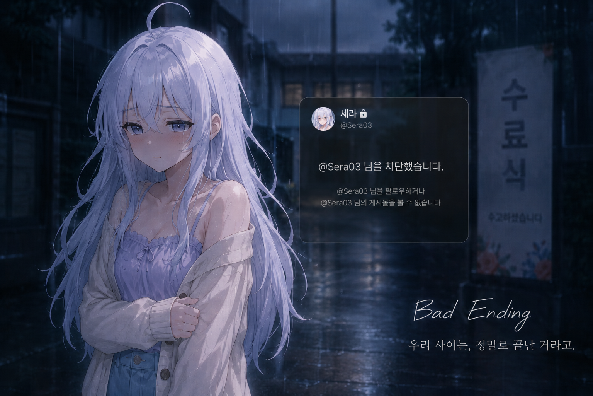

# 커널을 좋아하는 옆자리의 그녀

> Software Maestro × First Love — Monogatari 엔진 기반 LLM 채팅 통합 미연시 프론트엔드

<p align="center">
  
</p>

---

## 프로젝트 소개

**커널을 좋아하는 옆자리의 그녀**는 비주얼 노벨 엔진 [Monogatari](https://monogatari.io/)를 기반으로 만든 미연시(연애 시뮬레이션) 게임입니다.

일반적인 선택지 기반 스토리 분기 외에, **LLM과의 실시간 채팅**이 핵심 플레이 방식으로 통합되어 있습니다. 플레이어는 주인공으로서 AI 캐릭터 **이세라**와 자유 대화를 나누며 호감도를 쌓고, 대화 맥락에 따라 여러 엔딩 중 하나로 분기합니다.

### 주요 특징

- **LLM 스트리밍 채팅 (SSE)**: 백엔드 SSE API를 통해 이세라와 실시간으로 대화. 발화마다 감정 분석 결과에 따라 캐릭터 스프라이트가 변화합니다.
- **호감도 시스템**: 대화 내용에 따라 호감도가 변동되며, 특정 임계값 도달 시 이벤트 토스트가 표시됩니다.
- **다중 엔딩 & 엔딩 도감**: Bad / Normal / Happy / Marriage 등 6가지 엔딩으로 분기되며, 클리어한 엔딩은 엔딩 도감에 기록됩니다.
- **감정 기반 표정 변화**: 평온 / 행복 / 수줍음 / 흥분 / 슬픔 / 화남 / 혐오 7종 스프라이트가 LLM 감정 분석 결과에 따라 실시간 전환됩니다.
- **씬 연동 BGM**: 씬 전환 시 BGM이 페이드 아웃 후 해당 씬의 트랙으로 자동 전환됩니다.
- **자동 저장 & 이어하기**: LLM 채팅 세션 상태를 백엔드와 동기화하여 게임 재개 시 이어하기를 지원합니다.

---

## 스크린샷

<table>
  <tr>
    <td align="center">
      <br/>
      <sub>연구실 — 이세라와의 첫 만남</sub>
    </td>
    <td align="center">
      <br/>
      <sub>심야 개발 — 함께하는 밤샘 코딩</sub>
    </td>
  </tr>
  <tr>
    <td align="center">
      <br/>
      <sub>고백 — 결정적인 순간</sub>
    </td>
    <td align="center">
      <br/>
      <sub>Marriage Ending — 최고의 결말</sub>
    </td>
  </tr>
  <tr>
    <td align="center">
      <br/>
      <sub>졸업 기념 여행 — 부산 광안리</sub>
    </td>
    <td align="center">
      <br/>
      <sub>Bad Ending — 호감도 관리에 실패하면…</sub>
    </td>
  </tr>
</table>

---

## 기술 스택

| 분류 | 기술 |
|------|------|
| 비주얼 노벨 엔진 | [Monogatari](https://monogatari.io/) |
| 언어 | Vanilla JavaScript (ES Modules) |
| 마크업/스타일 | HTML5, CSS3 |
| 개발 서버 | http-server |
| LLM 백엔드 | SSE + REST API (`http://127.0.0.1:8000/api/v1`) |

---

## 실행 방법

### 사전 요구 사항

- [Node.js](https://nodejs.org/) 14+ 및 npm (또는 Yarn)
- 백엔드 서버가 `http://127.0.0.1:8000`에서 실행 중이어야 합니다.

### 방법 1 — VS Code Live Server (권장)

1. VS Code 확장에서 **Live Server**를 설치합니다.
2. `index.html`을 열고 우클릭 → **Open with Live Server**를 선택합니다.
3. `http://localhost:5500`에서 게임이 자동으로 열립니다.

### 방법 2 — http-server (Node.js)

```bash
# 최초 1회
npm install -g http-server

# 실행
http-server . -p 5500 -o
```

`http://localhost:5500`에서 게임이 열립니다.

> **주의**: `index.html`을 파일 탐색기에서 직접 더블클릭하면 ES 모듈 제한으로 동작하지 않습니다. 반드시 HTTP 서버를 통해 열어야 합니다.

---

## 파일 구조

```
js/
├── main.js          # 진입점 — $_ready, Monogatari 초기화
├── engine.js        # window.Monogatari re-export
├── constants.js     # 모든 상수·순수 헬퍼 함수 (스프라이트 맵, 씬 키, API 주소 등)
├── api.js           # 세션·엔딩 API 호출 (fetch 래퍼)
├── ui.js            # UI 오버레이·이펙트 전체 (HUD, 스프라이트, 제안 버튼, 로그 뷰어 등)
├── save.js          # 자동 저장 로직
├── scene-router.js  # 씬 전환 헬퍼
├── game-flow.js     # chatStreamState, 게임 진입/종료 흐름
├── menu.js          # SomaMainMenu, SomaSettingsScreen, 커스텀 리스너
├── lifecycle.js     # MutationObserver, 키바인딩
├── script.js        # Monogatari 등록 + 모든 시나리오 라벨
├── chat-stream.js   # SSE 스트리밍 채팅 처리
├── audio.js         # BGM 페이드 매니저 (씬별 트랙 전환)
└── ending-dex.js    # 엔딩 도감 (localStorage 기반 클리어 기록)
```

---

## 백엔드 API 연동

게임은 다음 엔드포인트를 사용합니다.

| 메서드 | 엔드포인트 | 용도 |
|--------|-----------|------|
| `GET`  | `/api/v1/sessions/me` | 현재 세션 상태 조회 |
| `POST` | `/api/v1/sessions` | 세션 생성 |
| `POST` | `/api/v1/sessions/me/start` | 세션 시작 (플레이어 이름 전달) |
| `GET`  | `/api/v1/sessions/me/resume` | 이어하기 데이터 조회 |
| `DELETE` | `/api/v1/sessions/me` | 세션 삭제 (초기화) |
| `POST` | `/api/v1/chat` | **SSE** 스트리밍 채팅 |
| `GET`  | `/api/v1/chat/suggestions` | 호감도 상승 예시 답안 |
| `GET`  | `/api/v1/chat/history` | 대화 히스토리 (커서 페이지네이션) |
| `GET`  | `/api/v1/scenes/current` | 현재 씬 메타 |
| `GET`  | `/api/v1/game/ending` | 엔딩 콘텐츠 조회 (LLM 생성 후 캐시) |

LLM 채팅은 `LLMChat` 라벨의 `Input` 액션 내에서 `chat-stream.js`가 SSE 방식으로 처리합니다.
